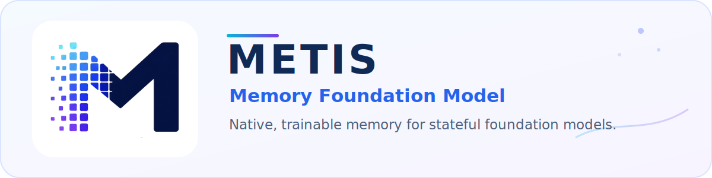
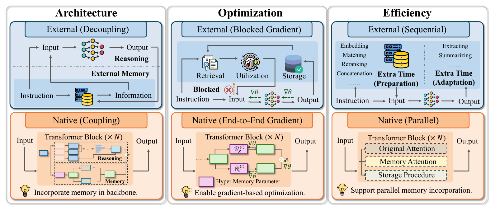
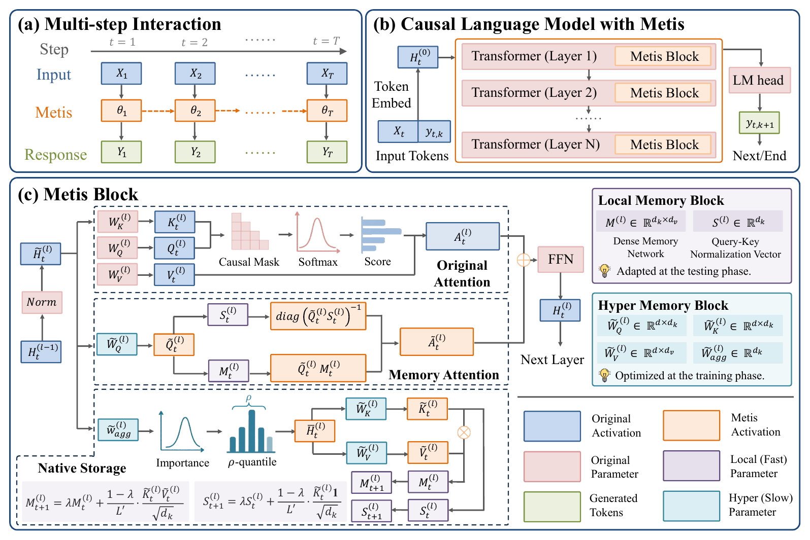
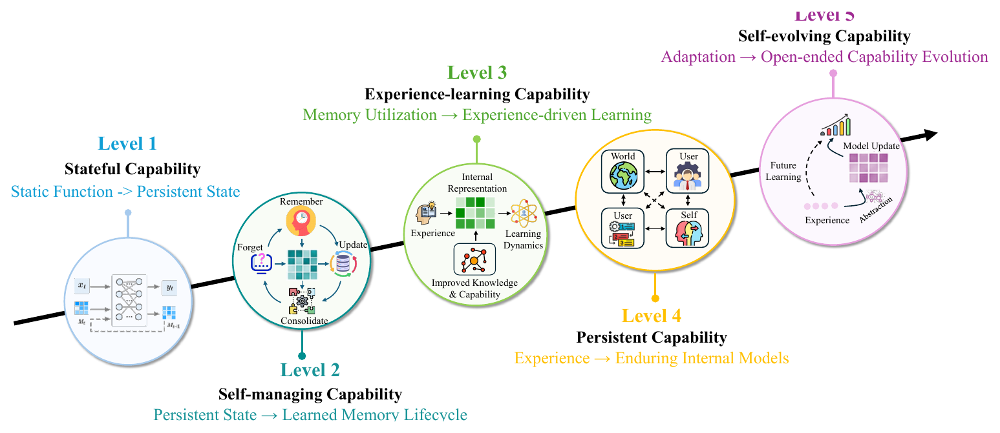

<div align="center">
  <picture>
    <source media="(prefers-color-scheme: dark)" srcset="assets/metis_hero_dark.svg">
    <source media="(prefers-color-scheme: light)" srcset="assets/metis_hero_light.svg">
    
  </picture>

  <p>
    <!-- TODO: 将下方 PAPER_URL 替换为公开技术报告链接（如 arXiv） -->
    <a href="https://arxiv.org/abs/XXXX.XXXXX"></a>
    
    
    <a href="#模型权重"></a>
  </p>

  <p>
    <a href="https://arxiv.org/abs/XXXX.XXXXX">论文</a> ·
    <a href="#快速开始">快速开始</a> ·
    <a href="#模型权重">模型</a> ·
    <a href="#引用">引用</a> ·
    <a href="README.md">English</a>
  </p>
</div>

> [!IMPORTANT]
> **研究预览版。** 当前仓库提供 Metis 核心架构、Qwen3/Qwen3.5/Llama 适配、多步中期训练代码、推理工具、DeepSpeed 配置以及 Checkpoint 工具。公开模型权重、训练数据和独立评测工具尚未包含在当前版本中。

## 项目简介

**Metis** 是首个 **Memory Foundation Model（记忆基础模型）** 原型：模型的记忆状态与记忆过程不再依赖外部检索工作流，而是成为模型自身计算过程的原生组成部分。

Metis 能够在多轮交互之间维护持久的逐层记忆状态，并在前向计算过程中学习如何执行 **记住、更新、遗忘、反思以及选择性使用记忆**。



本项目主要探索三个方向：

- **原生记忆状态。** 动态参数状态位于 Backbone 内部，并直接参与后续前向计算。
- **原生记忆过程。** 记忆的写入与使用由数据驱动训练获得，而不是由独立的检索、重排和 Prompt 拼接规则实现。
- **固定大小的会话状态。** 历史信息被压缩到紧凑状态中，后续查询无需重复回放原始文本历史。

Metis 仍是一个早期研究系统，并非对外部记忆机制的完整替代。将原生记忆与外部记忆结合的混合系统仍是重要研究方向。

## 模型架构



每个 **Metis Block** 被插入 Transformer 层中，并包含两个组件：

- **Local Memory Block：** 维护跨交互步骤持续存在的动态记忆矩阵与归一化状态。
- **Hyper Memory Block：** 学习 Token 选择、记忆 Key/Value 投影、独立记忆 Query 以及状态更新过程。

在一次记忆步骤完成后，Metis 会选择具有信息量的隐藏状态并更新 Local Memory。后续查询通过 Memory Attention 读取该状态，并将结果与原始 Attention 分支融合。论文中的实现采用 **Gated Delta Network（GDN）** 进行状态更新。

在当前 Qwen3.5 混合架构实现中，Metis 接入 Full-Attention 层；Linear-Attention 层保持原有计算路径。

## 快速开始

### 1. 创建环境

```bash
conda env create -f environment.yml
conda activate metis
```

仓库中的环境文件是研究环境锁定文件，基于 Python 3.10、PyTorch 2.4.1 + CUDA 11.8、Transformers 5.4.0、DeepSpeed 和 Flash Linear Attention。CUDA 扩展可能需要根据具体硬件与平台进行调整。

### 2. 检查源码

```bash
python -m compileall -q metis train
python train/run_train.py --help
```

### 3. 运行推理

从 Metis delta 或完整 Checkpoint 运行推理：

```bash
bash infer.sh /path/to/checkpoint \
  --prompt "Hello" \
  --max_new_tokens 128
```

多轮推理（记忆跨轮持久化）时重复传入 `--prompt`：

```bash
python run_inference.py \
  --checkpoint_path /path/to/checkpoint \
  --prompt "Remember that my code name is Polaris." \
  --prompt "What is my code name?" \
  --commit_mode exchange
```

`--commit_mode` 支持：

| 模式 | 行为 |
| --- | --- |
| `none` | 不更新记忆 |
| `user` | 将用户消息写入记忆 |
| `exchange` | 将用户消息和模型回复一起写入记忆 |

若 delta checkpoint 已被移动，可通过 `--model_path /path/to/backbone` 或 `MODEL_PATH` 环境变量指定基座模型。运行 `python run_inference.py --help` 查看全部选项。

### 运行时记忆生命周期

```python
model.reset()

# 将一次交互写入原生记忆状态。
model(
    **memory_inputs,
    commit_memory=True,
    use_cache=False,
    logits_to_keep=1,
)

# 查询时无需重新回放原始记忆文本。
answer_ids = model.generate(
    **query_inputs,
    max_new_tokens=32,
    do_sample=False,
)

# 开始一个新的独立会话。
model.reset()
```

## 数据格式

Metis 接受扁平布局的 JSONL 数据：

```text
data/train/remember_explicit.jsonl
```

或嵌套布局：

```text
data/train/remember/explicit_data.jsonl
```

每行为一个 JSON 对象。`messages` 是记忆块（chunk）列表，每个块是一组对话消息。`query_turn_id` 指定哪个块的最后一条 assistant 回复参与损失计算。

```json
{
  "sample_id": "sample-001",
  "messages": [
    [
      {"role": "user", "content": "Remember that my code name is Polaris."},
      {"role": "assistant", "content": "I will remember it."}
    ],
    [
      {"role": "user", "content": "What is my code name?"},
      {"role": "assistant", "content": "Your code name is Polaris."}
    ]
  ],
  "query_turn_id": 1,
  "metadata": {"type": "remember", "style": "explicit"}
}
```

支持的任务 ID：

| 任务 | 数据 |
| --- | --- |
| 0 | 重建与显式/隐式回忆 |
| 1 | 记住、遗忘、更新与反思操作 |
| 2 | 干扰项与长上下文样本 |
| 3 | 标记为 `task3` 的样本 |
| 4 | 标记为 `task4` 的样本 |

## 数据预处理

分别对训练集与验证集进行预分词：

```bash
python scripts/tokenize_dataset.py \
  --data_dir data/train \
  --output_dir data/tokenized/train \
  --model_path /path/to/backbone \
  --tasks 0,1,2,3,4 \
  --max_total_tokens 1024

python scripts/tokenize_dataset.py \
  --data_dir data/valid \
  --output_dir data/tokenized/valid \
  --model_path /path/to/backbone \
  --tasks 0,1,2,3,4 \
  --max_total_tokens 1024
```

使用 `--overwrite` 覆盖已存在的分词缓存。

## 训练

```bash
bash scripts/train.sh \
  --model-path /path/to/backbone \
  --name metis-run \
  --train-data data/tokenized/train \
  --valid-data data/tokenized/valid \
  --output-dir checkpoints
```

默认使用预分词数据。添加 `--data-format raw` 可直接从 JSONL 文件训练。

常用选项：

```text
--backbone-type qwen3_5|qwen3|llama
--cuda-visible-devices 0,1,2,3
--nproc-per-node 4
--batch-size 2
--grad-accum 10
--metis-hyper-memory-type LastTokenGatedDeltaRuleMetisHyperMemory
--deepspeed configs/ds_zero3.json
```

运行 `bash scripts/train.sh --help` 查看完整的启动器接口。

训练在后台运行。日志写入 `logs/`，模型输出写入 `<output-dir>/<name>/`。

### 验证

当 `EVAL_STEPS` 大于零时，训练过程会在固定验证子集上执行损失评估与生成评估。

```text
<output-dir>/<name>/eval_samples_manifest.json
<output-dir>/<name>/eval_metrics.jsonl
```

通过 `EVAL_STEPS`、`GEN_EVAL_STEPS`、`EVAL_SAMPLES` 和 `EVAL_SAMPLES_PER_TASK` 配置验证行为。

## 数据与训练目标

Metis 使用按时间顺序排列的多步交互进行中期训练。前序步骤改变原生记忆状态，后续查询步骤提供监督答案。

| 记忆行为 | 训练模式 |
|---|---|
| 记住 | 写入事实，并在后续查询中回答 |
| 更新 | 使用新值替换旧值 |
| 遗忘 | 在后续查询前撤销信息 |
| 反思 | 组合多个已存储事实 |
| 鲁棒性 | 处理干扰信息、多实体、选择性遗忘以及无需读取记忆的对话 |

训练目标由三部分组成：

1. **记忆重建：** 预热高保真存储与恢复能力。
2. **记忆操作：** 学习由指令驱动的记住、更新、遗忘和反思。
3. **正则化：** 降低事实间干扰、连带遗忘和记忆污染。

中期训练阶段冻结 Backbone，仅优化原生记忆参数。完整的数据构造流程、采样课程与目标函数见[技术报告](https://arxiv.org/abs/XXXX.XXXXX)第 4–5 节。

## 论文要点

技术报告在查询阶段不回放原始证据的设置下评估 Metis。

- Metis-27B 在 Metis Test 上达到 **73.77**，在 NextMem 上达到 **50.82**。
- 在受控的单张 A800、batch size 为 1、4B 模型上下文长度扫描实验中，Metis 的查询延迟基本不随已存储历史长度增长；在 128K 历史、生成 32 个 Token 的设置下，相比 Full Context 查询取得 **11.37× 的查询延迟加速**。
- Metis-4B 的 Rank-64 状态每个会话占用 **2.11 MB**，并在技术报告的压缩实验中保留 Full State 平均得分的 **99.9%**。

以上结果依赖具体模型、硬件和评测配置。完整的实验表格、Prompt、Baseline 与评测协议见[技术报告](https://arxiv.org/abs/XXXX.XXXXX)。

## 模型权重

公开模型权重尚未发布，发布后将在此处提供链接。

## 路线图



技术报告将原生记忆的发展划分为五个阶段：从 **Stateful Capability**，逐步走向 **Self-Managing Memory**、**Experience-Driven Learning**、**Persistent Cognition**，最终达到 **Self-Evolving Capability**。

## 引用

仓库根目录包含机器可读的 `CITATION.cff`。

```bibtex
@misc{zhang2026metis,
  title        = {Metis: Memory Foundation Model},
  author       = {Zhang, Zeyu and Guo, Ziliang and Sun, Yihang and Zhang, Xichong and
                  Hao, Xixuan and Lin, Zehao and Zhang, Yang and Zhao, Xiaoyan and
                  Shen, Tong and Tang, Bo and Xu, Zhi-Qin John and Yan, Junchi and
                  Wang, Haofen and Chen, Xu and Xiong, Feiyu and Li, Zhiyu and
                  Chua, Tat-Seng},
  year         = {2026},
  howpublished = {Technical report}
}
```

## 许可证

本项目对论文与仓库软件分别采用以下许可证：

- **论文：** Metis 技术报告及原创论文材料采用 [Creative Commons Attribution-NonCommercial-ShareAlike 4.0 International（CC BY-NC-SA 4.0）](LICENSE-PAPER) 许可证。
- **仓库软件：** 本仓库源代码采用 [PolyForm Noncommercial License 1.0.0](LICENSE) 许可证。

PolyForm Noncommercial License 不允许将本仓库软件用于商业用途。如需获得商业使用许可，请联系作者。

除非另有明确说明，模型权重、数据集、评测资源、商标及第三方材料不属于上述许可证的覆盖范围；其适用条款将在对应资源发布时另行说明。

## 致谢

Metis 基于 PyTorch、Hugging Face Transformers、DeepSpeed、Flash Linear Attention 与 Qwen3.5 构建，并受到 Fast Weight Programming、Memory-Augmented Neural Networks、Test-Time Training、长上下文建模和 Agent Memory 等研究方向的启发。

## 联系方式

研究联系邮箱：[lizy@memtensor.cn](mailto:lizy@memtensor.cn) 和 [xu.chen@ruc.edu.cn](mailto:xu.chen@ruc.edu.cn)。
